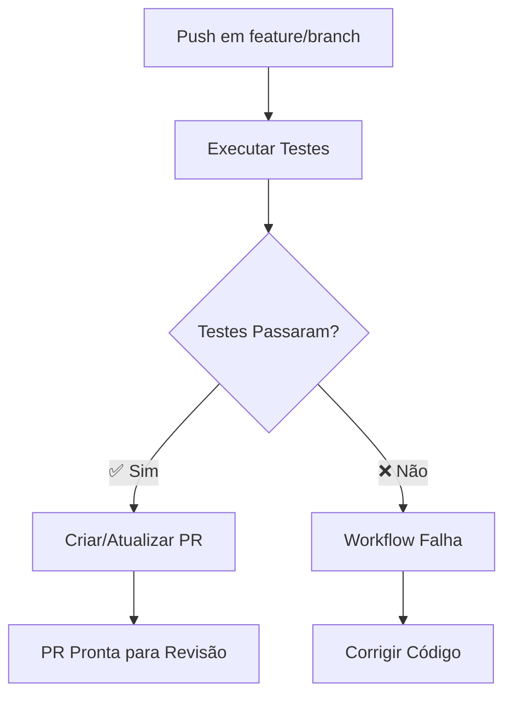

# 🚀 GitHub Actions - Automação de Testes e PRs

Este repositório contém GitHub Actions que automatizam o processo de testes e criação de Pull Requests.

## 📋 Workflows Implementados

### 1. `python-test.yaml` - Testes Unitários e PR
**Trigger**: Push em branches `feature/*`

**Fluxo**:
1. ✅ Executa testes unitários
2. 🚀 Se sucesso → Cria PR automaticamente para `develop`

### 2. `auto-pr.yaml` - Criação Automática de PR
**Trigger**: Após sucesso do workflow de testes

**Funcionalidades**:
- 🔍 Verifica se PR já existe
- 📝 Cria PR com template detalhado
- 🏷️ Adiciona labels automáticas
- 💬 Comenta em PRs existentes

## 🎯 Como Funciona

### Fluxo Completo:


## 🔧 Configuração

### Pré-requisitos:
1. ✅ Branch `develop` deve existir (ou usará `main`)
2. ✅ Testes unitários configurados
3. ✅ `requirements.txt` no diretório `tests/`

### Estrutura de Branches:
```
main/develop (produção)
├── feature/nova-funcionalidade
├── feature/correcao-bug
└── feature/ajustes
```

## 📝 Template da PR Automática

As PRs criadas automaticamente incluem:

- 📋 **Resumo das alterações**
- ✅ **Status dos testes**
- 📝 **Informações do commit**
- 🔍 **Detalhes da branch**
- 📋 **Checklist para revisão**
- 🚀 **Próximos passos**

## 🏷️ Labels Automáticas

- `automated-pr` - PR criada automaticamente
- `tests-passed` - Todos os testes passaram
- `ready-for-review` - Pronta para revisão
- `do-not-auto-merge` - Não fazer merge automático

## 🎯 Uso Prático

### 1. Criar Feature Branch:
```bash
git checkout -b feature/minha-nova-funcionalidade
# Fazer alterações...
git add .
git commit -m "feat: adicionar nova funcionalidade"
git push origin feature/minha-nova-funcionalidade
```

### 2. Automação:
- ✅ Testes executam automaticamente
- 🚀 PR é criada automaticamente se testes passarem
- 📧 Você recebe notificação da PR criada

### 3. Revisão Manual:
- 👀 Revisar código na PR
- ✅ Aprovar quando estiver ok
- 🔀 Fazer merge manualmente

## ⚙️ Configurações Avançadas

### Personalizar Target Branch:
No arquivo `python-test.yaml`, altere:
```yaml
--base develop  # Alterar para main se necessário
```

### Adicionar Reviewers Automáticos:
```yaml
--reviewer usuario1,usuario2
```

### Personalizar Labels:
```yaml
--add-label "custom-label,another-label"
```

## 🔍 Troubleshooting

### ❌ Testes Falhando:
```bash
# Executar testes localmente
cd brewery_pipeline
python -m pytest tests/ -v
```

### ❌ PR não sendo criada:
1. Verificar se branch é `feature/*`
2. Verificar permissões do `GITHUB_TOKEN`
3. Verificar se branch `develop` existe

### ❌ Workflow não executando:
1. Verificar sintaxe YAML
2. Verificar triggers configurados
3. Verificar se actions estão habilitadas

## 📊 Monitoramento

### Ver Status dos Workflows:
- GitHub → Actions tab
- Verificar logs de execução
- Monitorar falhas e sucessos

### Métricas Úteis:
- ✅ Taxa de sucesso dos testes
- 🕐 Tempo médio de execução
- 📈 Número de PRs criadas automaticamente

## 🚀 Próximos Passos

### Melhorias Futuras:
- [ ] Adicionar testes de integração
- [ ] Configurar deploy automático
- [ ] Adicionar análise de código
- [ ] Configurar notificações Slack
- [ ] Adicionar métricas de cobertura

## 🎯 Benefícios

### Para Desenvolvedores:
- ⚡ Feedback rápido dos testes
- 🤖 Automação de tarefas repetitivas
- 📝 PRs padronizadas e detalhadas

### Para o Projeto:
- 🛡️ Qualidade de código garantida
- 🔄 Processo padronizado
- 📊 Rastreabilidade completa

---

**Dica**: Sempre verificar se os testes passam localmente antes de fazer push! ✅
