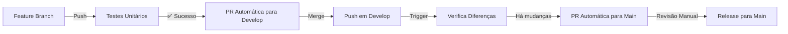

# 🤖 Automação de Pull Requests - Fluxo Completo

Este documento explica o sistema completo de automação de PRs implementado no projeto.

## 📋 Fluxo de Automação

### 1. 🔧 Feature Branch → Develop

**Trigger**: Push em branches `feature/**`

**Workflow**: `python-test.yaml`

**Processo**:
1. ✅ Executa todos os testes unitários
2. 🔍 Se testes passarem, verifica se PR para `develop` já existe
3. 📝 Se não existir, cria nova PR automaticamente
4. 💬 Se existir, adiciona comentário com status dos testes

**Resultado**: PR automática de `feature/branch` → `develop`

### 2. 🚀 Develop → Main (Release)

**Trigger**: Push em branch `develop`

**Workflow**: `develop-to-main-pr.yaml`

**Processo**:
1. 🔍 Verifica se há diferenças entre `develop` e `main`
2. 📊 Conta quantos commits novos existem
3. 🔍 Se há mudanças e não existe PR, cria PR de release
4. 📝 Se PR já existe, atualiza com novas mudanças
5. 🏷️ Adiciona labels de release e comentários informativos

**Resultado**: PR automática de `develop` → `main` (Release)

## 📁 Estrutura dos Workflows

```
.github/workflows/
├── python-test.yaml           # Testes + PR feature → develop
├── develop-to-main-pr.yaml    # PR develop → main
└── auto-pr.yaml              # Workflow auxiliar (backup)
```

## 🔄 Fluxo Completo



## 📋 Características dos Workflows

### 🔧 Python Test (Feature → Develop)

**Arquivo**: `python-test.yaml`

**Funcionalidades**:
- ✅ Execução de testes unitários
- 🔍 Verificação de PR existente
- 📝 Criação automática de PR
- 💬 Comentários de status
- 🏷️ Labels automáticas

**Labels utilizadas**:
- `enhancement` (padrão do GitHub)

### 🚀 Develop to Main (Release)

**Arquivo**: `develop-to-main-pr.yaml`

**Funcionalidades**:
- 📊 Análise de diferenças entre branches
- 📝 Criação de PR de release
- 📋 Release notes automáticas
- 🔍 Lista de commits incluídos
- ⚠️ Avisos de segurança para release

**Labels utilizadas**:
- `release`
- `enhancement`

## 🛡️ Segurança e Controles

### ✅ Controles Implementados

1. **Não merge automático**: Todas as PRs requerem revisão manual
2. **Labels informativos**: Identificação clara do tipo de PR
3. **Comentários detalhados**: Contexto completo sobre mudanças
4. **Verificação de diferenças**: Só cria PR se há mudanças reais
5. **Avisos de release**: Alertas especiais para PRs de produção

### 📋 Checklist de Revisão

#### Para PRs Feature → Develop:
- [ ] Testes unitários passando
- [ ] Código revisado
- [ ] Sem conflitos de merge
- [ ] Funcionalidade testada

#### Para PRs Develop → Main (Release):
- [ ] Todas as features validadas em develop
- [ ] Documentação atualizada
- [ ] Sem breaking changes não documentadas
- [ ] Versão/changelog atualizado se necessário
- [ ] Aprovação de pelo menos um revisor

## 🔧 Configuração e Manutenção

### Variáveis Utilizadas

```yaml
# Branches monitoradas
feature/**  # Para PRs automáticas para develop
develop     # Para PRs automáticas para main

# Tokens necessários
GITHUB_TOKEN  # Fornecido automaticamente pelo GitHub
```

### 🛠️ Personalização

Para modificar o comportamento:

1. **Alterar branches alvo**: Editar seções `branches` nos workflows
2. **Modificar labels**: Ajustar comandos `gh pr edit --add-label`
3. **Customizar mensagens**: Editar templates nos comandos `gh pr create`
4. **Adicionar verificações**: Incluir novos steps nos workflows

## 📊 Monitoramento

### Como Acompanhar

1. **GitHub Actions**: `Actions` tab no repositório
2. **Pull Requests**: Lista de PRs com labels automáticas
3. **Logs dos workflows**: Detalhes de execução e erros

### 🚨 Troubleshooting

#### PRs não sendo criadas:
- Verificar se testes estão passando
- Confirmar que branch está sendo pusheada corretamente
- Verificar logs do workflow no GitHub Actions

#### Labels não funcionando:
- Verificar se labels existem no repositório
- Criar labels manualmente se necessário (ver `create-labels.md`)

#### Permissões de token:
- GITHUB_TOKEN deve ter permissões de escrita no repositório
- Verificar configurações de permissões no repositório

## 🎯 Benefícios

### ✅ Vantagens do Sistema

1. **Automação completa**: Reduz trabalho manual
2. **Consistência**: Processo padronizado para todas as PRs
3. **Rastreabilidade**: Histórico completo de mudanças
4. **Segurança**: Múltiplas verificações antes de release
5. **Eficiência**: Acelera o ciclo de desenvolvimento

### 📈 Métricas de Sucesso

- Redução de tempo para criação de PRs
- Diminuição de erros manuais
- Maior consistência nos releases
- Melhor rastreabilidade de mudanças

---

*Sistema implementado em Julho 2025 - Versão 1.0* 🚀
